# @capgo/capacitor-sheets

<a href="https://capgo.app/">
  
</a>

Framework-agnostic sheets, drawers, dialogs, scroll helpers, and overlay primitives for Capacitor apps.

This package is inspired by the public Silk feature surface, but it is not a wrapper around Silk and does not include Silk source code. It uses platform web APIs and custom elements so the same primitives work in React, Vue, Angular, Svelte, Solid, or plain TypeScript.

## Usecase Demos

Each usecase has its own animated WebP demo. These match the public Silk-style example set: long sheets, detents, sidebars, bottom/top sheets, keyboard-aware sheets, toasts, detached sheets, full pages, stacking, depth, parallax, lightboxes, persistent detents, and cards.

<table>
  <tr>
    <td>
      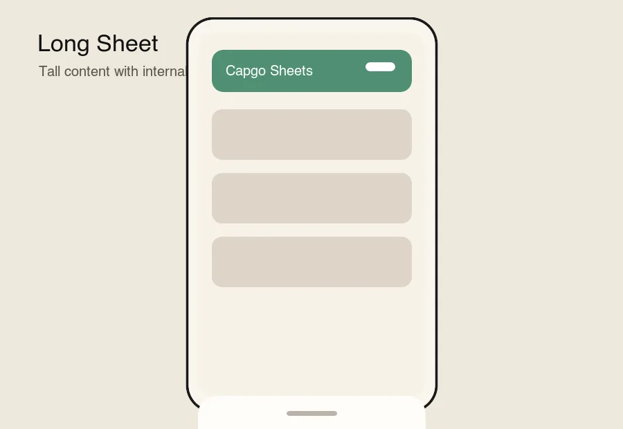
      <br />
      <strong>Long Sheet</strong>
    </td>
    <td>
      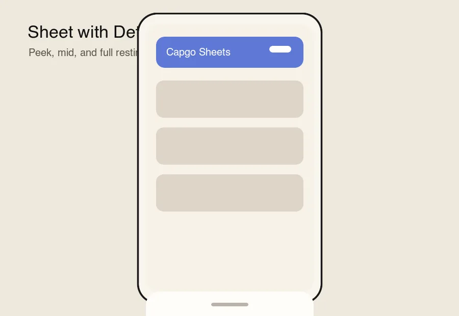
      <br />
      <strong>Sheet with Detent</strong>
    </td>
  </tr>
  <tr>
    <td>
      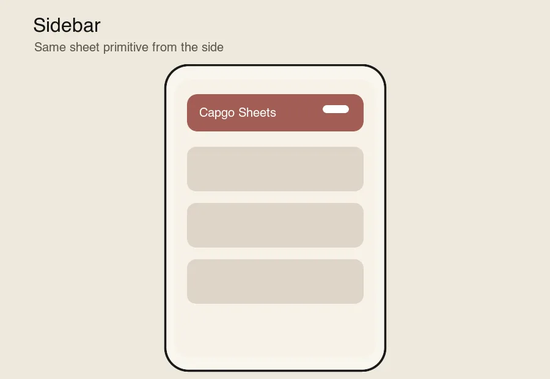
      <br />
      <strong>Sidebar</strong>
    </td>
    <td>
      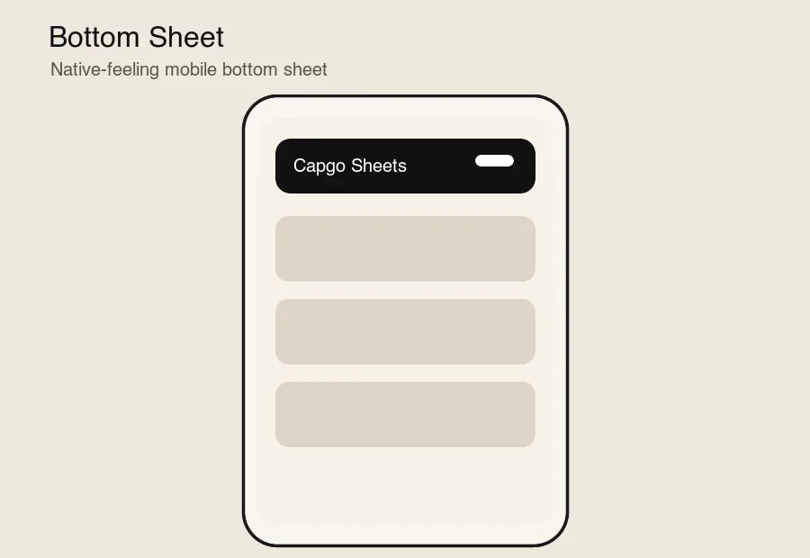
      <br />
      <strong>Bottom Sheet</strong>
    </td>
  </tr>
  <tr>
    <td>
      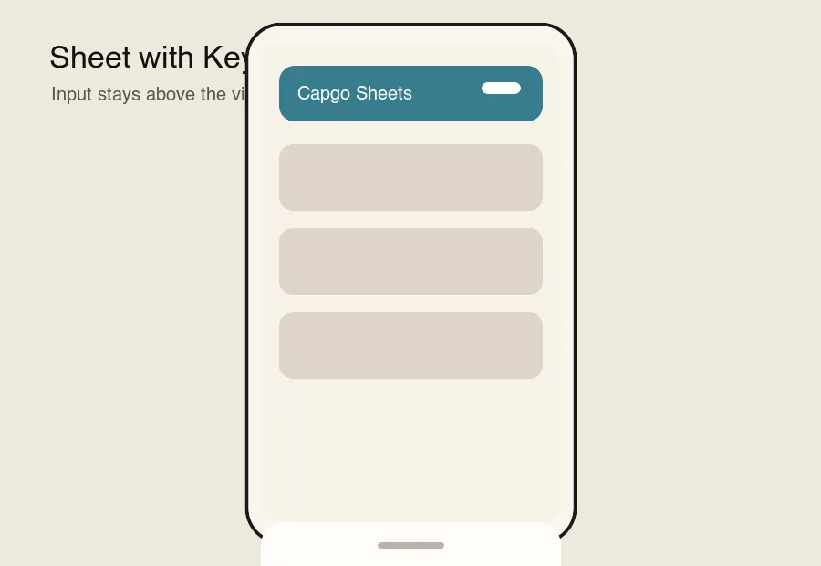
      <br />
      <strong>Sheet with Keyboard</strong>
    </td>
    <td>
      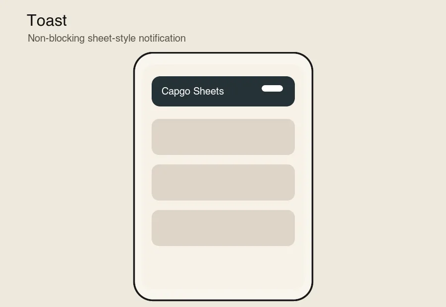
      <br />
      <strong>Toast</strong>
    </td>
  </tr>
  <tr>
    <td>
      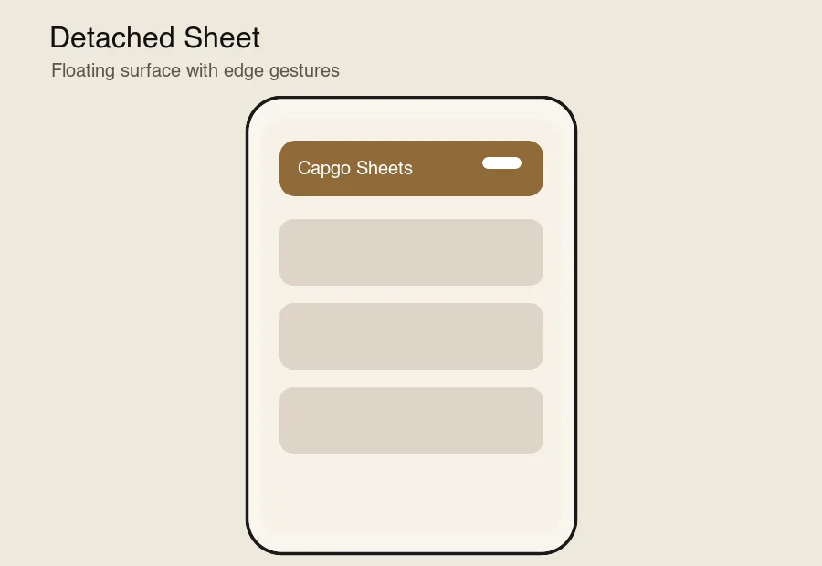
      <br />
      <strong>Detached Sheet</strong>
    </td>
    <td>
      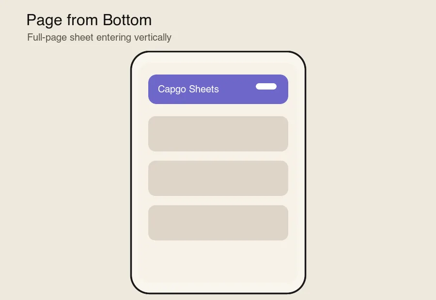
      <br />
      <strong>Page from Bottom</strong>
    </td>
  </tr>
  <tr>
    <td>
      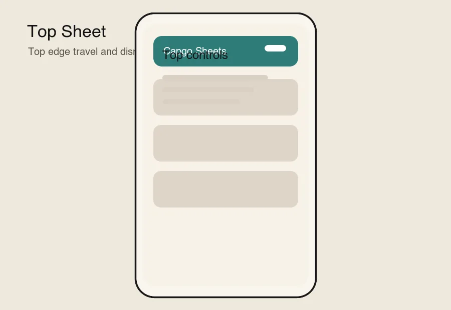
      <br />
      <strong>Top Sheet</strong>
    </td>
    <td>
      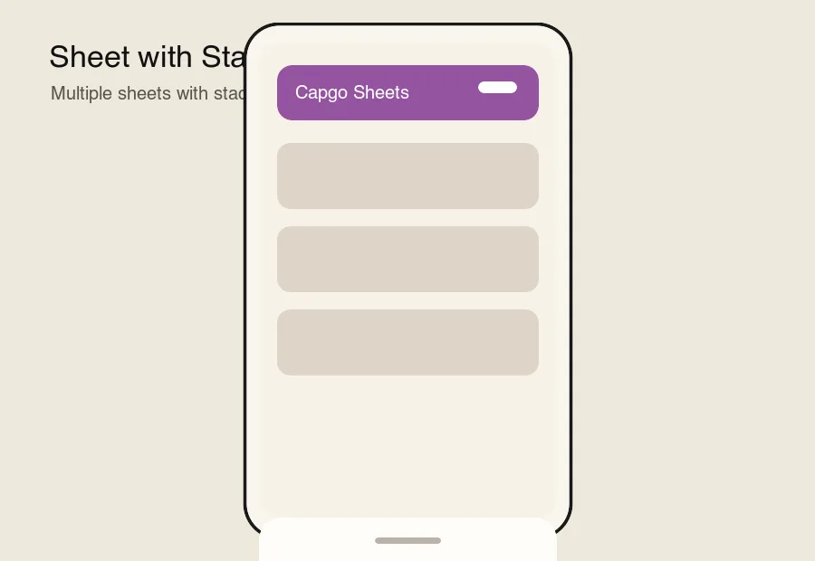
      <br />
      <strong>Sheet with Stacking</strong>
    </td>
  </tr>
  <tr>
    <td>
      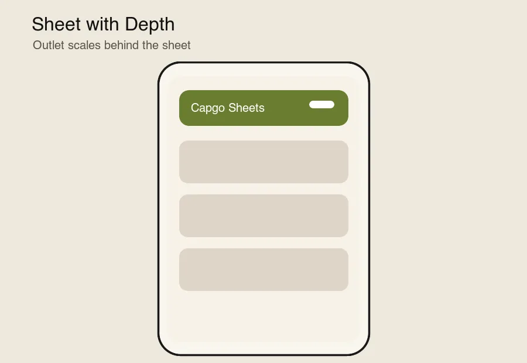
      <br />
      <strong>Sheet with Depth</strong>
    </td>
    <td>
      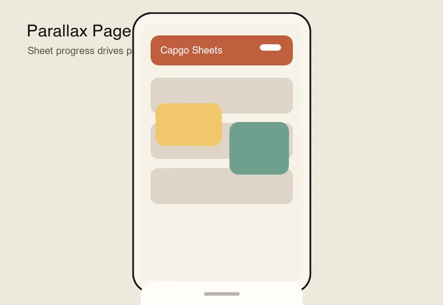
      <br />
      <strong>Parallax Page</strong>
    </td>
  </tr>
  <tr>
    <td>
      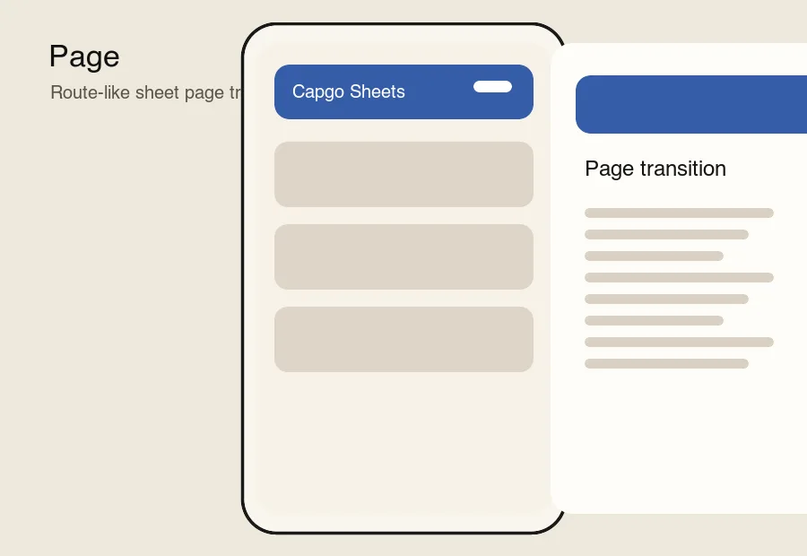
      <br />
      <strong>Page</strong>
    </td>
    <td>
      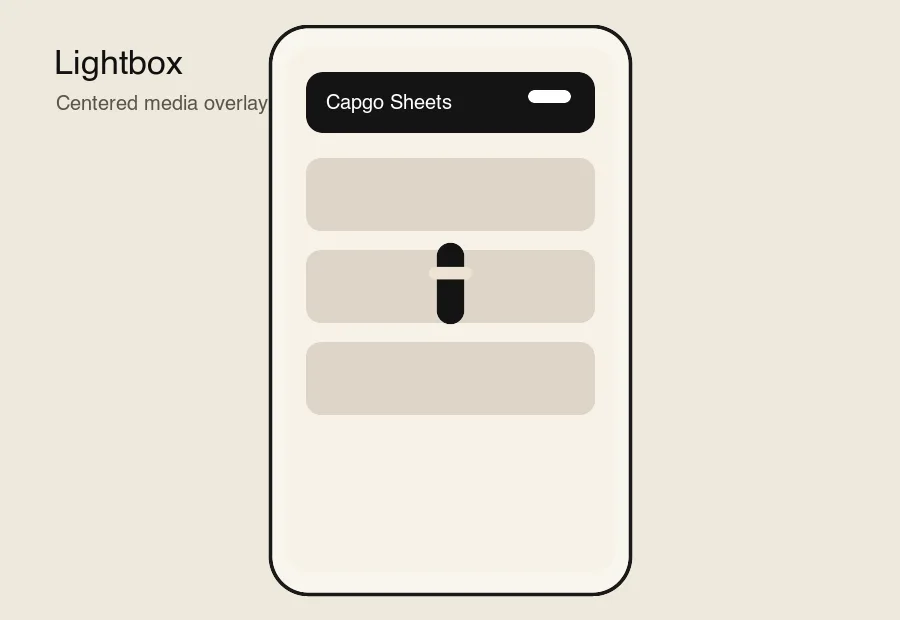
      <br />
      <strong>Lightbox</strong>
    </td>
  </tr>
  <tr>
    <td>
      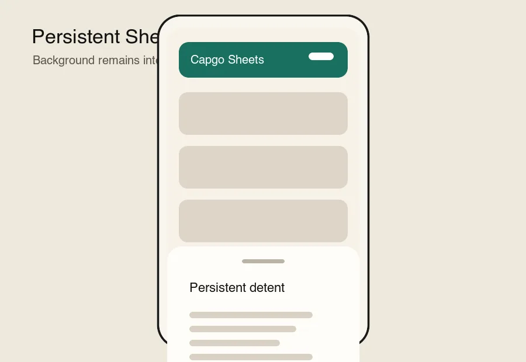
      <br />
      <strong>Persistent Sheet with Detent</strong>
    </td>
    <td>
      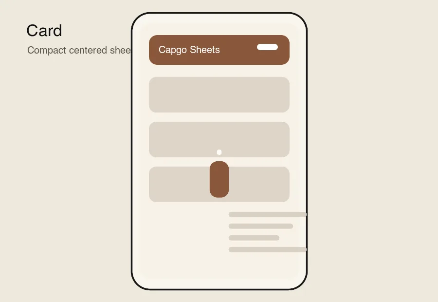
      <br />
      <strong>Card</strong>
    </td>
  </tr>
</table>

## Online Playgrounds

Each framework example opens the same 16-usecase gallery, so StackBlitz is useful for testing the full surface instead of a single smoke-test sheet:

- [React playground](https://stackblitz.com/github/Cap-go/capacitor-sheets?file=examples/react-app/src/main.tsx&startScript=stackblitz-react)
- [Vue playground](https://stackblitz.com/github/Cap-go/capacitor-sheets?file=examples/vue-app/src/App.vue&startScript=stackblitz-vue)
- [Angular playground](https://stackblitz.com/github/Cap-go/capacitor-sheets?file=examples/angular-app/src/app/app.component.ts&startScript=stackblitz-angular)
- [Svelte playground](https://stackblitz.com/github/Cap-go/capacitor-sheets?file=examples/svelte-app/src/App.svelte&startScript=stackblitz-svelte)
- [Solid playground](https://stackblitz.com/github/Cap-go/capacitor-sheets?file=examples/solid-app/src/main.tsx&startScript=stackblitz-solid)

## Features

- **Framework agnostic** custom elements: no React runtime dependency in the core package.
- **Bottom sheets, side drawers, top sheets, and centered dialogs** through `content-placement`.
- **Detents** with `em`, `rem`, `dvh`, `lvh`, `svh`, `calc()`, and other modern CSS lengths.
- **Touch, pointer, wheel, and trackpad gestures** with dismissal, overshoot, and trap controls.
- **Modal behavior**: focus trap, focus restore, Escape dismissal, outside-click dismissal, and inert outside content.
- **Capacitor safe-area defaults** using `env(safe-area-inset-*)` plus Capacitor SystemBars `--safe-area-inset-*` fallbacks.
- **Keyboard-aware layout** using `visualViewport` resize/scroll events and `preventScroll` focus behavior.
- **Overlay compatibility** through `cap-island` and `cap-external-overlay`.
- **Stacking and outlet animation hooks** for depth effects and coordinated page motion.
- **Scroll primitives** with progress/distance helpers.
- **Theme color dimming** for Capacitor WebViews and mobile browsers.
- **Modern CSS defaults** authored with `em`-based sizing, with no design-system lock-in.

## Usecase Coverage

| Usecase                      | Capgo Sheets pattern                                                                                      |
| ---------------------------- | --------------------------------------------------------------------------------------------------------- |
| Long Sheet                   | `cap-sheet` + `cap-scroll` or naturally scrolling `cap-sheet-content`                                     |
| Sheet with Detent            | `detents="18em 32em"` and `stepTo()` / `cap-sheet-trigger action="step"`                                  |
| Sidebar                      | `content-placement="left"` or `content-placement="right"`                                                 |
| Bottom Sheet                 | default `content-placement="bottom"`                                                                      |
| Sheet with Keyboard          | visual viewport offset support via `native-focus-scroll-prevention`                                       |
| Toast                        | `inert-outside="false"`, `close-on-outside-click="false"`, `focus-trap="false"`                           |
| Detached Sheet               | rounded content with margins and `cap-sheet-special-wrapper` composition                                  |
| Page from Bottom             | full-height bottom sheet content                                                                          |
| Top Sheet                    | `content-placement="top"`                                                                                 |
| Sheet with Stacking          | `cap-sheet-stack`, stack depth variables, and stacking animation hooks                                    |
| Sheet with Depth             | `cap-sheet-outlet` progress variables and `travelAnimation`                                               |
| Parallax Page                | `cap-sheet-outlet` + `cap-scroll` progress composition                                                    |
| Page                         | full-viewport sheet content or side-entering `content-placement`                                          |
| Lightbox                     | `content-placement="center"` plus backdrop and media content                                              |
| Persistent Sheet with Detent | `default-presented`, `swipe-dismissal="false"`, `inert-outside="false"`, `close-on-outside-click="false"` |
| Card                         | `content-placement="center"` with compact content                                                         |

## Installation

```bash
npm install @capgo/capacitor-sheets
npx cap sync
```

## Capacitor Setup

Add `viewport-fit=cover` so iOS exposes safe-area insets to CSS:

```html
<meta name="viewport" content="width=device-width, initial-scale=1.0, viewport-fit=cover" />
```

Safe areas are enabled by default. `cap-sheet-view` reads standard `env(safe-area-inset-*)` values and Capacitor SystemBars fallback variables such as `--safe-area-inset-bottom`, then applies them to the sheet viewport in `em`-based layout. You can opt out or choose edges per sheet:

```text
<cap-sheet safe-area="none"></cap-sheet>
<cap-sheet safe-area="bottom left right"></cap-sheet>
```

For Capacitor apps with overlay status/system bars, keep the platform plugins responsible for exposing correct insets:

```ts
import type { CapacitorConfig } from '@capacitor/cli';

const config: CapacitorConfig = {
  plugins: {
    StatusBar: {
      overlaysWebView: true,
    },
    Keyboard: {
      resize: 'body',
      resizeOnFullScreen: true,
    },
    SystemBars: {
      insetsHandling: 'css',
    },
  },
};

export default config;
```

Keyboard handling is on by default through `native-focus-scroll-prevention`. It listens to `visualViewport` changes, keeps focused controls visible above the keyboard, and restores the sheet offset when the keyboard closes.

## Vanilla Usage

```html
<script type="module">
  import '@capgo/capacitor-sheets';
</script>

<cap-sheet-trigger for="booking-sheet" action="present">Open</cap-sheet-trigger>

<cap-sheet id="booking-sheet" detents="18em 32em" content-placement="bottom">
  <cap-sheet-portal>
    <cap-sheet-view>
      <cap-sheet-backdrop></cap-sheet-backdrop>
      <cap-sheet-content class="sheet">
        <cap-sheet-bleeding-background></cap-sheet-bleeding-background>
        <cap-sheet-handle></cap-sheet-handle>
        <cap-sheet-title>Evening route</cap-sheet-title>
        <cap-sheet-description>Choose a route and confirm pickup.</cap-sheet-description>
        <cap-sheet-trigger action="dismiss">Done</cap-sheet-trigger>
      </cap-sheet-content>
    </cap-sheet-view>
  </cap-sheet-portal>
</cap-sheet>
```

```css
.sheet {
  width: min(100%, 34em);
  padding: 0 1.25em 1.25em;
}
```

## Five Framework Examples

Full runnable examples live in:

- `examples/react-app`
- `examples/vue-app`
- `examples/angular-app`
- `examples/svelte-app`
- `examples/solid-app`

All five apps mount the shared usecase gallery from `examples/shared/usecase-gallery.ts`. That gallery covers Long Sheet, Sheet with Detent, Sidebar, Bottom Sheet, Sheet with Keyboard, Toast, Detached Sheet, Page from Bottom, Top Sheet, Sheet with Stacking, Sheet with Depth, Parallax Page, Page, Lightbox, Persistent Sheet with Detent, and Card.

### React

```tsx
import { setupSheet } from '@capgo/capacitor-sheets/react';
import { useEffect, useRef } from 'react';
import '@capgo/capacitor-sheets';
import { mountUsecaseGallery } from '../../shared/usecase-gallery';

export function App() {
  const galleryRef = useRef<HTMLDivElement>(null);

  useEffect(() => {
    if (!galleryRef.current) return;
    return mountUsecaseGallery(galleryRef.current, {
      framework: 'React',
      setupSheet,
    });
  }, []);

  return <div ref={galleryRef} />;
}
```

### Vue

```vue
<script setup lang="ts">
import { onMounted, onUnmounted, ref } from 'vue';
import { setupSheet } from '@capgo/capacitor-sheets/vue';
import '@capgo/capacitor-sheets';
import { mountUsecaseGallery } from '../../shared/usecase-gallery';

const galleryRef = ref<HTMLElement | null>(null);
let cleanup: (() => void) | undefined;

onMounted(() => {
  if (galleryRef.value) {
    cleanup = mountUsecaseGallery(galleryRef.value, {
      framework: 'Vue',
      setupSheet,
    });
  }
});

onUnmounted(() => cleanup?.());
</script>

<template>
  <div ref="galleryRef"></div>
</template>
```

### Angular

```ts
import type { AfterViewInit, ElementRef, OnDestroy } from '@angular/core';
import { Component, CUSTOM_ELEMENTS_SCHEMA, ViewChild } from '@angular/core';
import { setupSheet } from '@capgo/capacitor-sheets/angular';
import '@capgo/capacitor-sheets';
import { mountUsecaseGallery } from '../../../shared/usecase-gallery';

@Component({
  selector: 'app-root',
  standalone: true,
  schemas: [CUSTOM_ELEMENTS_SCHEMA],
  template: `<div #gallery></div>`,
})
export class AppComponent implements AfterViewInit, OnDestroy {
  @ViewChild('gallery', { static: true }) gallery?: ElementRef<HTMLElement>;
  private cleanup?: () => void;

  ngAfterViewInit(): void {
    if (this.gallery?.nativeElement) {
      this.cleanup = mountUsecaseGallery(this.gallery.nativeElement, {
        framework: 'Angular',
        setupSheet,
      });
    }
  }

  ngOnDestroy(): void {
    this.cleanup?.();
  }
}
```

### Svelte

```svelte
<script lang="ts">
  import { onMount } from 'svelte'
  import { setupSheet } from '@capgo/capacitor-sheets/svelte'
  import '@capgo/capacitor-sheets'
  import { mountUsecaseGallery } from '../../shared/usecase-gallery'

  let gallery: HTMLDivElement

  onMount(() =>
    mountUsecaseGallery(gallery, {
      framework: 'Svelte',
      setupSheet,
    }),
  )
</script>

<div bind:this={gallery}></div>
```

### Solid

```tsx
import { onCleanup, onMount } from 'solid-js';
import { setupSheet } from '@capgo/capacitor-sheets/solid';
import '@capgo/capacitor-sheets';
import { mountUsecaseGallery } from '../../shared/usecase-gallery';

export function App() {
  let galleryEl!: HTMLDivElement;

  onMount(() => {
    const cleanup = mountUsecaseGallery(galleryEl, {
      framework: 'Solid',
      setupSheet,
    });
    onCleanup(cleanup);
  });

  return <div ref={galleryEl} />;
}
```

## API Surface

Core elements:

- `cap-sheet`: state, detents, placement, gestures, modal behavior, lifecycle events.
- `cap-sheet-trigger`: declarative present, dismiss, toggle, and step actions.
- `cap-sheet-portal`: optional body portal for overlay layering.
- `cap-sheet-view`: viewport overlay host.
- `cap-sheet-backdrop`: progress-synced modal backdrop.
- `cap-sheet-content`: accessible sheet surface.
- `cap-sheet-bleeding-background`: background extension for rounded edge sheets.
- `cap-sheet-handle`: draggable and keyboard-accessible detent handle.
- `cap-sheet-title` and `cap-sheet-description`: accessible naming.
- `cap-sheet-special-wrapper` and `cap-sheet-special-wrapper-content`: composition hooks for detached sheets, cards, lightboxes, and custom page layouts.
- `cap-sheet-stack`: groups sheets for stacked depth.
- `cap-sheet-outlet`: receives sheet progress variables and optional `travelAnimation`.
- `cap-scroll` and `cap-scroll-content`: scroll progress helpers.
- `cap-fixed`, `cap-island`, `cap-external-overlay`, `cap-visually-hidden`, `cap-auto-focus-target`: composition and accessibility helpers.

Important events:

- `cap-sheet-presented-change`
- `cap-sheet-active-detent-change`
- `cap-sheet-travel`
- `cap-sheet-travel-status-change`
- `cap-sheet-travel-range-change`
- `cap-sheet-drag-start`
- `cap-sheet-drag-end`
- `cap-scroll`

Imperative methods on `cap-sheet`:

```ts
const sheet = document.querySelector('cap-sheet')!;
await sheet.present();
await sheet.dismiss();
await sheet.toggle();
await sheet.stepTo(2);
await sheet.step('down');
```

The public TypeScript API is documented with TSDoc in `src/core/types.ts`, and generated declarations are emitted during `npm run build`.

## Development

```bash
npm install
npm run render:demos
npm run build
npm run dev:examples -- react vue svelte angular solid
```

In the Capgo monorepo, use `bun` and `bunx` for local commands.
