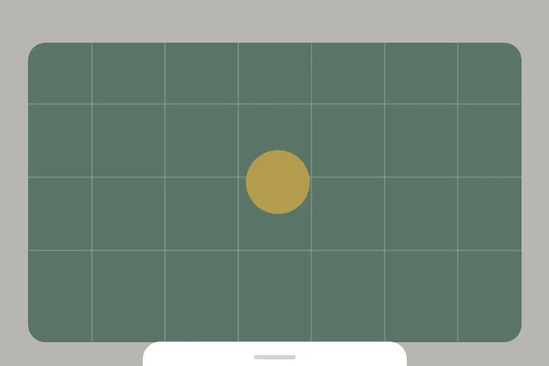

# @capgo/capacitor-sheets

<a href="https://capgo.app/">
  
</a>

Framework-agnostic sheets, drawers, dialogs, scroll helpers, and overlay primitives for Capacitor apps.



This package is inspired by the public Silk feature surface, but it is not a wrapper around Silk and does not include Silk source code. It uses platform web APIs and custom elements so the same primitives work in React, Vue, Angular, Svelte, Solid, or plain TypeScript.

## Features

- **Framework agnostic** custom elements: no React runtime dependency in the core package.
- **Bottom sheets, side drawers, top sheets, and centered dialogs** through `content-placement`.
- **Detents** with `em`, `rem`, `dvh`, `lvh`, `svh`, `calc()`, and other modern CSS lengths.
- **Touch, pointer, wheel, and trackpad gestures** with dismissal, overshoot, and trap controls.
- **Modal behavior**: focus trap, focus restore, Escape dismissal, outside-click dismissal, and inert outside content.
- **Overlay compatibility** through `cap-island` and `cap-external-overlay`.
- **Stacking and outlet animation hooks** for depth effects and coordinated page motion.
- **Scroll primitives** with progress/distance helpers.
- **Theme color dimming** for Capacitor WebViews and mobile browsers.
- **Modern CSS defaults** authored with `em`-based sizing, with no design-system lock-in.

## Installation

```bash
npm install @capgo/capacitor-sheets
npx cap sync
```

## Vanilla Usage

```html
<script type="module">
  import '@capgo/capacitor-sheets';
</script>

<cap-sheet-trigger for="booking-sheet" action="present">Open</cap-sheet-trigger>

<cap-sheet id="booking-sheet" detents="18em 32em" content-placement="bottom">
  <cap-sheet-portal>
    <cap-sheet-view>
      <cap-sheet-backdrop></cap-sheet-backdrop>
      <cap-sheet-content class="sheet">
        <cap-sheet-bleeding-background></cap-sheet-bleeding-background>
        <cap-sheet-handle></cap-sheet-handle>
        <cap-sheet-title>Evening route</cap-sheet-title>
        <cap-sheet-description>Choose a route and confirm pickup.</cap-sheet-description>
        <cap-sheet-trigger action="dismiss">Done</cap-sheet-trigger>
      </cap-sheet-content>
    </cap-sheet-view>
  </cap-sheet-portal>
</cap-sheet>
```

```css
.sheet {
  width: min(100%, 34em);
  padding: 0 1.25em 1.25em;
}
```

## Five Framework Examples

Full runnable examples live in:

- `examples/react-app`
- `examples/vue-app`
- `examples/angular-app`
- `examples/svelte-app`
- `examples/solid-app`

### React

```tsx
import { useEffect, useRef } from 'react';
import { setupSheet } from '@capgo/capacitor-sheets/react';
import '@capgo/capacitor-sheets';

export function BookingSheet() {
  const sheetRef = useRef<HTMLElement>(null);

  useEffect(() => {
    if (!sheetRef.current) return;
    return setupSheet(sheetRef.current, {
      detents: ['18em', '32em'],
      contentPlacement: 'bottom',
    });
  }, []);

  return (
    <cap-sheet id="booking-sheet" ref={sheetRef}>
      <cap-sheet-trigger action="present">Open</cap-sheet-trigger>
      <cap-sheet-view>
        <cap-sheet-backdrop />
        <cap-sheet-content>
          <cap-sheet-handle />
          <cap-sheet-title>React sheet</cap-sheet-title>
        </cap-sheet-content>
      </cap-sheet-view>
    </cap-sheet>
  );
}
```

### Vue

```vue
<script setup lang="ts">
import { onMounted, onUnmounted, ref } from 'vue';
import { setupSheet } from '@capgo/capacitor-sheets/vue';
import '@capgo/capacitor-sheets';

const sheetRef = ref<HTMLElement | null>(null);
let cleanup: (() => void) | undefined;

onMounted(() => {
  if (sheetRef.value) cleanup = setupSheet(sheetRef.value, { detents: ['18em', '32em'] });
});

onUnmounted(() => cleanup?.());
</script>

<template>
  <cap-sheet id="booking-sheet" ref="sheetRef">
    <cap-sheet-trigger action="present">Open</cap-sheet-trigger>
    <cap-sheet-view>
      <cap-sheet-backdrop />
      <cap-sheet-content>
        <cap-sheet-handle />
        <cap-sheet-title>Vue sheet</cap-sheet-title>
      </cap-sheet-content>
    </cap-sheet-view>
  </cap-sheet>
</template>
```

### Angular

```ts
import { AfterViewInit, Component, CUSTOM_ELEMENTS_SCHEMA, ElementRef, ViewChild } from '@angular/core';
import { setupSheet } from '@capgo/capacitor-sheets/angular';
import '@capgo/capacitor-sheets';

@Component({
  selector: 'app-root',
  standalone: true,
  schemas: [CUSTOM_ELEMENTS_SCHEMA],
  template: `
    <cap-sheet id="booking-sheet" #sheet>
      <cap-sheet-trigger action="present">Open</cap-sheet-trigger>
      <cap-sheet-view>
        <cap-sheet-backdrop></cap-sheet-backdrop>
        <cap-sheet-content>
          <cap-sheet-handle></cap-sheet-handle>
          <cap-sheet-title>Angular sheet</cap-sheet-title>
        </cap-sheet-content>
      </cap-sheet-view>
    </cap-sheet>
  `,
})
export class AppComponent implements AfterViewInit {
  @ViewChild('sheet', { static: true }) sheet?: ElementRef<HTMLElement>;

  ngAfterViewInit(): void {
    if (this.sheet?.nativeElement) setupSheet(this.sheet.nativeElement, { detents: ['18em', '32em'] });
  }
}
```

### Svelte

```svelte
<script lang="ts">
  import { sheet } from '@capgo/capacitor-sheets/svelte'
  import '@capgo/capacitor-sheets'
</script>

<cap-sheet id="booking-sheet" use:sheet={{ detents: ['18em', '32em'] }}>
  <cap-sheet-trigger action="present">Open</cap-sheet-trigger>
  <cap-sheet-view>
    <cap-sheet-backdrop />
    <cap-sheet-content>
      <cap-sheet-handle />
      <cap-sheet-title>Svelte sheet</cap-sheet-title>
    </cap-sheet-content>
  </cap-sheet-view>
</cap-sheet>
```

### Solid

```tsx
import { onCleanup, onMount } from 'solid-js';
import { setupSheet } from '@capgo/capacitor-sheets/solid';
import '@capgo/capacitor-sheets';

export function BookingSheet() {
  let sheetEl!: HTMLElement;

  onMount(() => {
    const cleanup = setupSheet(sheetEl, { detents: ['18em', '32em'] });
    onCleanup(cleanup);
  });

  return (
    <cap-sheet id="booking-sheet" ref={sheetEl}>
      <cap-sheet-trigger action="present">Open</cap-sheet-trigger>
      <cap-sheet-view>
        <cap-sheet-backdrop />
        <cap-sheet-content>
          <cap-sheet-handle />
          <cap-sheet-title>Solid sheet</cap-sheet-title>
        </cap-sheet-content>
      </cap-sheet-view>
    </cap-sheet>
  );
}
```

## API Surface

Core elements:

- `cap-sheet`: state, detents, placement, gestures, modal behavior, lifecycle events.
- `cap-sheet-trigger`: declarative present, dismiss, toggle, and step actions.
- `cap-sheet-portal`: optional body portal for overlay layering.
- `cap-sheet-view`: viewport overlay host.
- `cap-sheet-backdrop`: progress-synced modal backdrop.
- `cap-sheet-content`: accessible sheet surface.
- `cap-sheet-bleeding-background`: background extension for rounded edge sheets.
- `cap-sheet-handle`: draggable and keyboard-accessible detent handle.
- `cap-sheet-title` and `cap-sheet-description`: accessible naming.
- `cap-sheet-stack`: groups sheets for stacked depth.
- `cap-sheet-outlet`: receives sheet progress variables and optional `travelAnimation`.
- `cap-scroll` and `cap-scroll-content`: scroll progress helpers.
- `cap-fixed`, `cap-island`, `cap-external-overlay`, `cap-visually-hidden`, `cap-auto-focus-target`: composition and accessibility helpers.

Important events:

- `cap-sheet-presented-change`
- `cap-sheet-active-detent-change`
- `cap-sheet-travel`
- `cap-sheet-drag-start`
- `cap-sheet-drag-end`
- `cap-scroll`

Imperative methods on `cap-sheet`:

```ts
const sheet = document.querySelector('cap-sheet')!;
await sheet.present();
await sheet.dismiss();
await sheet.toggle();
await sheet.stepTo(2);
await sheet.step('down');
```

The public TypeScript API is documented with TSDoc in `src/core/types.ts`, and generated declarations are emitted during `npm run build`.

## Development

```bash
npm install
npm run build
npm run dev:examples -- react vue svelte angular solid
```

In the Capgo monorepo, use `bun` and `bunx` for local commands.
